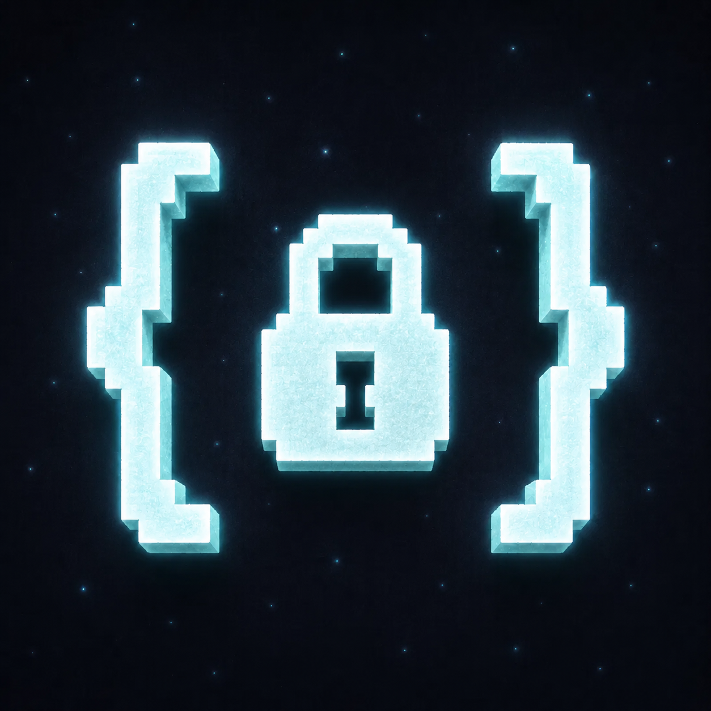

<div align="center">



# Fiw AntiCheat

**Mod verification &amp; enforcement for Minecraft servers — Fabric, Forge &amp; NeoForge**

[](https://modrinth.com/mod/fiw-anticheat)


</div>

A professional **mod verification, anti-cheat support, and admin enforcement**
tool for Minecraft servers. It is split into one shared engine and one small
adapter per loader/version.

## Supported Targets

| Minecraft | Loader | Module | Java |
|---|---|---|---|
| 1.20.1 | Fabric | `fabric-1.20.1` | 17 |
| 1.20.1 | MinecraftForge | `forge-1.20.1` | 17 |
| 1.21.1 | Fabric | `fabric-1.21.1` | 21 |
| 1.21.1 | NeoForge | `neoforge-1.21.1` | 21 |
| 1.21.11 | Fabric | `fabric-1.21.11` | 21 |
| 1.21.11 | NeoForge | `neoforge-1.21.11` | 21 |

NeoForge does not publish a real Minecraft 1.20.1 artifact on the current
NeoForge Maven. The Forge-family 1.20.1 target is therefore built against
MinecraftForge 47.x.

## What It Does

On player join, the server sends a nonce challenge. A client with the companion
mod reports its loaded mods, versions, jar fingerprints, and stable code markers.
The server evaluates that list, then either unfreezes the player or disconnects
them.

Main features:

- `blacklist` mode, the default: players may run anything except blocked mods.
- `whitelist` mode: only the captured official modpack set is allowed.
- Bundled signature database for known unfair mods, matched by mod id and stable
  markers such as packages and mixin configs.
- Per-player profile history showing current mods and changes over time. Profile
  output separates real/player-installed mods from noisy loader/API entries.
- Floodgate/Geyser Bedrock player exemption by reflection when Floodgate exists.

This is a modpack enforcer, not a cheat-proof anti-cheat. A modified companion
client can lie; this mod makes honest clients enforceable and makes simple jar or
id renames much less useful.

## Documentation

- [Full documentation (English)](DOCS_EN.md): protocol, complete config
  reference, modes, signatures, commands, profiles, building and troubleshooting.
- [Documentacion completa (espanol)](DOCS_ES.md): mismo contenido que la version
  en ingles (protocolo, config, modos, firmas, comandos, perfiles, compilado).
- [Guia de uso en espanol](docs/README.md): guia practica de instalacion y uso.

## Configuration

The server writes `config/fiw-mods-api/config.json` on first run.

```jsonc
{
  "mode": "blacklist",
  "timeout_seconds": 10,
  "kick_message": "You are using a mod not allowed on this server.",
  "timeout_message": "Mod verification timed out. Please rejoin.",
  "detection": {
    "preset": "balanced",
    "monitor_only": false,
    "alert_staff": true,
    "block": { "...": "used only when preset == custom" },
    "allow_overrides": [],
    "banned_mods": []
  },
  "exemptions": { "floodgate_auto": true, "bypass_players": [] },
  "profiling": { "enabled": true, "max_history": 200 },
  "whitelist": { "require_all": true, "official_mods": [] }
}
```

Presets:

| Preset | Blocks |
|---|---|
| `strict` | all bundled categories |
| `balanced` | cheat clients, x-ray, fullbright, freecam, autoclicker, schematic printer |
| `lenient` | cheat clients, x-ray, autoclicker |
| `custom` | exactly `detection.block` |

`allow_overrides`, `banned_mods`, and `bypass_players` apply on top of presets.
Set `monitor_only` to log detections without kicking during rollout.

## Commands

`/fiwmods` requires permission level 4.

| Command | Description |
|---|---|
| `/fiwmods reload` | Reload config and bundled signatures |
| `/fiwmods snapshot server` | Capture the server's loaded mods as whitelist |
| `/fiwmods snapshot player <name>` | Capture an online player's reported mods as whitelist |
| `/fiwmods profile <name>` | Show grouped current mods and recent profile history |

## Building And Testing

Use Java 21 to run the full multi-project build. Java 17 can build the 1.20.1
targets with configure-on-demand, but Java 25 is too new for this Gradle/Groovy
stack.

```bash
./gradlew --configure-on-demand :core:test \
  :fabric-1.20.1:build \
  :forge-1.20.1:build \
  :fabric-1.21.1:build \
  :neoforge-1.21.1:build \
  :fabric-1.21.11:build \
  :neoforge-1.21.11:build
```

Dev server examples:

```bash
./gradlew --configure-on-demand :neoforge-1.21.1:runServer
./gradlew --configure-on-demand :fabric-1.21.1:runServer
./gradlew --configure-on-demand :forge-1.20.1:runServer
./gradlew --configure-on-demand :fabric-1.20.1:runServer
./gradlew --configure-on-demand :fabric-1.21.11:runServer
./gradlew --configure-on-demand :neoforge-1.21.11:runServer
```

Production jars are written under each module's `build/libs/` directory.

## Project Layout

```text
core/             Pure Java engine: config, signatures, evaluation, profiles
fabric-1.20.1/    Fabric 1.20.1 adapter, legacy channel networking
fabric-1.21.1/    Fabric 1.21.1 adapter, CustomPayload networking
forge-1.20.1/     MinecraftForge 1.20.1 adapter
neoforge-1.21.1/  NeoForge 1.21.1 adapter
fabric-1.21.11/   Fabric 1.21.11 adapter, CustomPayload networking
neoforge-1.21.11/ NeoForge 1.21.11 adapter
```

The bundled signature list is `core/src/main/resources/signatures.json`.

## License

[Fiw AntiCheat License (Attribution, Non-Commercial)](LICENSE). You are free to
use, modify, fork, and redistribute it — including modified builds — as long as
you give clear, visible credit to the original creator (**Fi3w0**) with a link
back and keep existing notices intact. You **may not sell it** or any fork
without written permission (running it on a server, even a monetized one, is
fine). Fi3w0 retains authorship of the original work.

Contact: Discord `fi3w0`.
